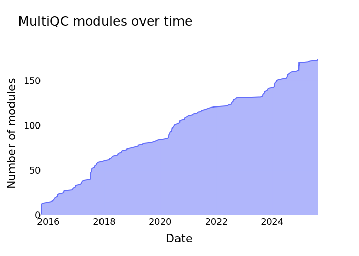
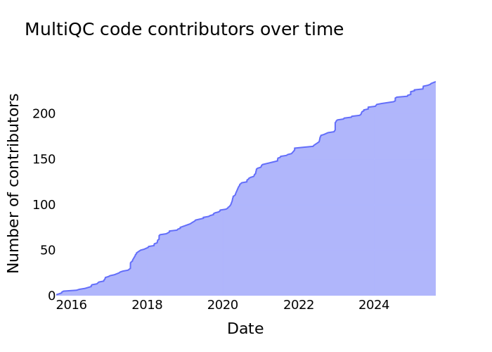
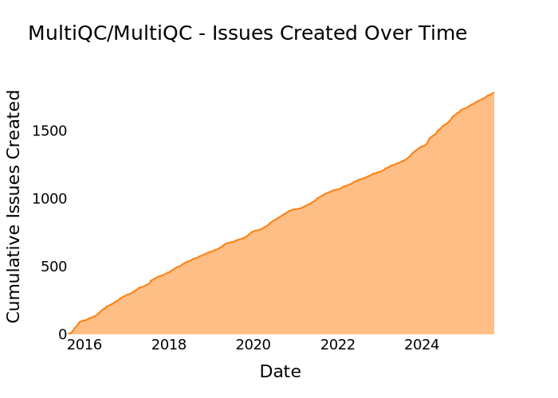
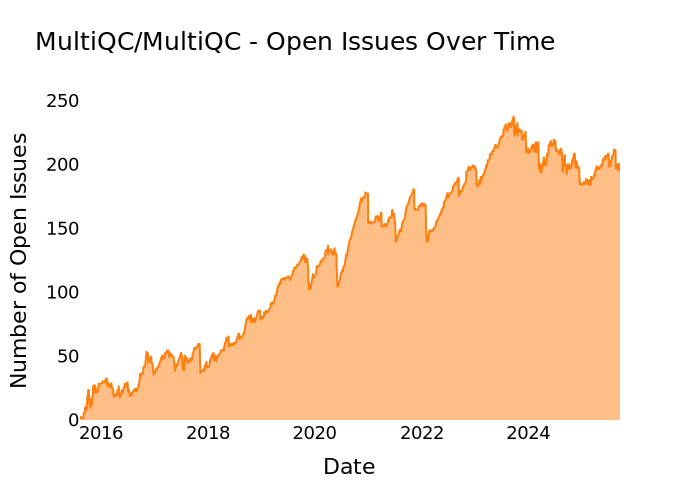
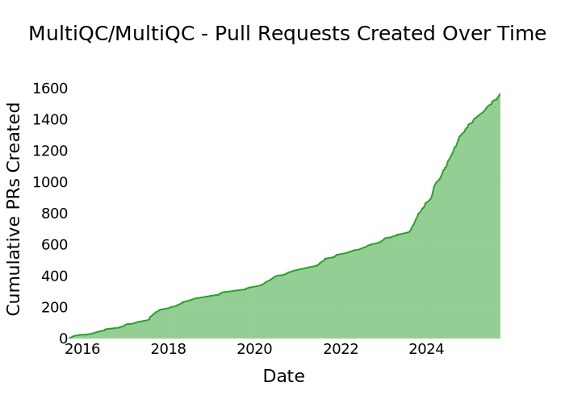
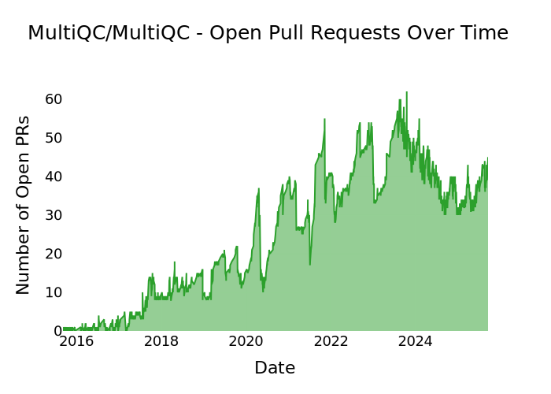

<h1>
<picture>
  <source media="(prefers-color-scheme: dark)" srcset="https://github.com/MultiQC/MultiQC/raw/main/docs/images/MultiQC_logo_darkbg.png">
  <source media="(prefers-color-scheme: light)" srcset="https://github.com/MultiQC/MultiQC/raw/main/docs/images/MultiQC_logo.png">
  
</picture>
</h1>

# MultiQC Stats

Automated statistics to plot MultiQC contributions over time.

This repository contains two main scripts:
- `generate_plots.py` - Analyzes the git repository locally to track modules and contributors
- `generate_github_stats.py` - Uses the GitHub API to track issues and pull requests

## Modules over time

This plot is generated by looping over repository commits and counting the number of files in the MultiQC modules directory.

<picture>
  <source media="(prefers-color-scheme: dark)" srcset="modules_over_time_dark.svg">
  <source media="(prefers-color-scheme: light)" srcset="modules_over_time_light.svg">
  
</picture>

## Contributors over time

This plot is generated by looping over commits to the main MultiQC repository and counting when a new contributor either contributes a commit, or co-authors a commit. The latter is found in commit messages and is needed for 2025 onwards, when MultiQC adopted a squash-merge strategy.

<picture>
  <source media="(prefers-color-scheme: dark)" srcset="contributors_over_time_dark.svg">
  <source media="(prefers-color-scheme: light)" srcset="contributors_over_time_light.svg">
  
</picture>

## GitHub Issues

### Issues Created Over Time

This plot shows the cumulative number of issues created in the MultiQC repository over time.

<picture>
  <source media="(prefers-color-scheme: dark)" srcset="issues_created_dark.svg">
  <source media="(prefers-color-scheme: light)" srcset="issues_created_light.svg">
  
</picture>

### Open Issues Over Time

This plot shows the number of open issues at any given point in time.

<picture>
  <source media="(prefers-color-scheme: dark)" srcset="issues_open_dark.svg">
  <source media="(prefers-color-scheme: light)" srcset="issues_open_light.svg">
  
</picture>

## GitHub Pull Requests

### Pull Requests Created Over Time

This plot shows the cumulative number of pull requests created in the MultiQC repository over time.

<picture>
  <source media="(prefers-color-scheme: dark)" srcset="prs_created_dark.svg">
  <source media="(prefers-color-scheme: light)" srcset="prs_created_light.svg">
  
</picture>

### Open Pull Requests Over Time

This plot shows the number of open pull requests at any given point in time.

<picture>
  <source media="(prefers-color-scheme: dark)" srcset="prs_open_dark.svg">
  <source media="(prefers-color-scheme: light)" srcset="prs_open_light.svg">
  
</picture>
