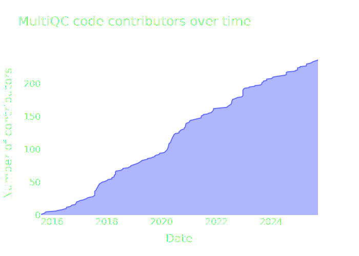

<h1>
<picture>
  <source media="(prefers-color-scheme: dark)" srcset="https://github.com/MultiQC/MultiQC/raw/main/docs/images/MultiQC_logo_darkbg.png">
  <source media="(prefers-color-scheme: light)" srcset="https://github.com/MultiQC/MultiQC/raw/main/docs/images/MultiQC_logo.png">
  
</picture>
</h1>

# MultiQC Stats

Automated statistics to plot MultiQC contributions over time.

## Modules over time

This plot is generated by looping over repository commits and counting the number of files in the MultiQC modules directory.

## Contributors over time

This plot is generated by looping over commits to the main MultiQC repository and counting when a new contributor either contributes a commit, or co-authors a commit. The latter is found in commit messages and is needed for 2025 onwards, when MultiQC adopted a squash-merge strategy.

